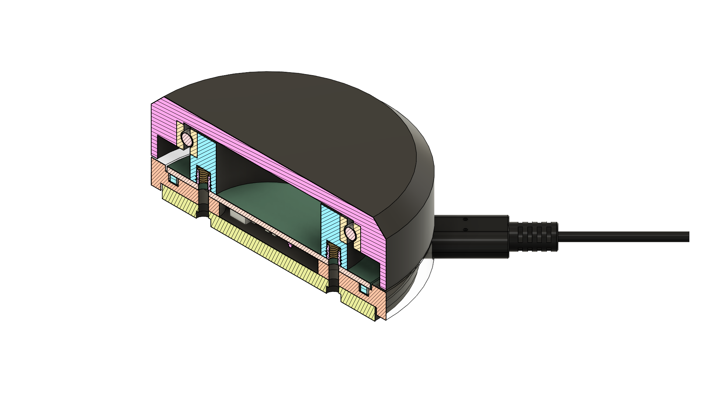

# Software for the RP2040 based Scroll Wheel

 This version is for the Hardware Version 1.

 

 ## Features
   -> AS5600 Magnetic Encoder
   -> RGP Status LED
   -> Enhanced Wheel Support in Windows

## Building

In order to build the *.uf2 file, which then can be transferred to the RP2040 by copying it to the virtual disk:

```
mkdir build
cd build
cmake ..
```

The file will be called main.uf2.
