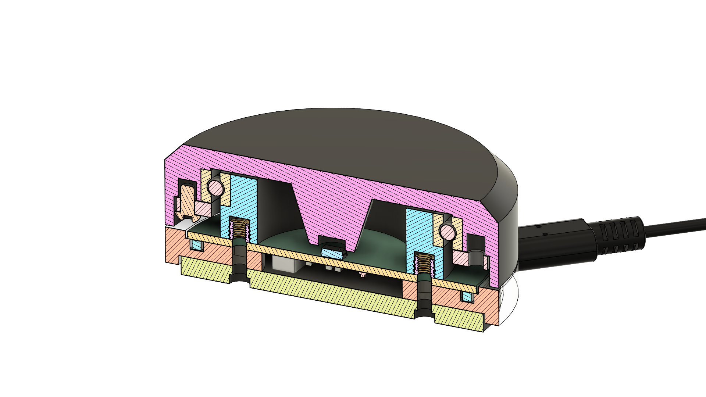

# Software for the RP2040 based Scroll Wheel

 This version is for the Hardware Version 2.

 

## Hardware Features
- TPS259630 E-Fuse
- RP2040
- AS5600 Magnetic Encoder
- AT24C02C I^2C EEPROM
- 18 WS2812b 4020 RGB leds

 ## Software Features
- [ ] LED ring with animations
- [x] Enhanced Wheel Support in Windows
- [x] Controll over the Resolution Multiplierer
- [ ] Changebel funktion like switch form scrolling to volume controll
- [ ] 2 Way comunication to the pc ofer usb hid vendor packages
- [ ] Write Configuration Data from the PC to the Device. Like custom Resolution Multiplier or color of the leds
- [ ] Button 

## Building

In order to build the *.uf2 file, which then can be transferred to the RP2040 by copying it to the virtual disk:

```
mkdir build
cd build
cmake ..
```

The file will be called main.uf2.


sudo src/openocd -s tcl -f interface/cmsis-dap.cfg -f target/rp2040.cfg -c "adapter speed 5000"